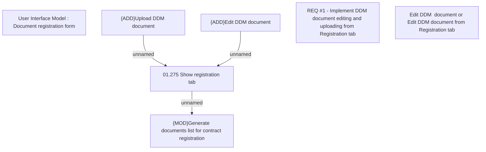

# REQ #1 - Implement DDM document editing and uploading from Registration tab

```mermaid
graph TD
    User_Interface_Model_Document_registration_form["User Interface Model : Document registration form"]
    ADD_Edit_DDM_document["{ADD}Edit DDM document"]
    ADD_Upload_DDM_document["{ADD}Upload DDM document"]
    MOD_Generate_documents_list_for_contract_registration["{MOD}Generate documents list for contract registration"]
    n_01_275_Show_registration_tab["01.275 Show registration tab"]
    REQ_1_Implement_DDM_document_editing_and_uploading_from_Regi["REQ #1 - Implement DDM document editing and uploading from Registration tab"]
    Edit_DDM_document_or_Edit_DDM_document_from_Registration_tab["Edit DDM  document or Edit DDM document from Registration tab"]
    ADD_Upload_DDM_document -->|unnamed| n_01_275_Show_registration_tab
    ADD_Edit_DDM_document -->|unnamed| n_01_275_Show_registration_tab
    n_01_275_Show_registration_tab -->|unnamed| MOD_Generate_documents_list_for_contract_registration
```
