# REQ #2 - Implement DDM document attributes validation before registration

- **Diagram Type**: Custom
- **Package**: HomerSelect/BSL/Requirements Model/Finished/CLM/CBL-4708 (CLM-2911) Scan Based Mandate Support in HOSEL
- **Diagram ID**: 127116
- **Elements**: 12
- **Connectors**: 0

```mermaid
graph TD
    External_Reference["External Reference"]
    RegisterContractFaultType["RegisterContractFaultType"]
    REQ_2_Implement_DDM_document_attributes_validation_before_re["REQ #2 - Implement DDM document attributes validation before registration"]
    Check_all["Check all"]
    Check["Check"]
    User_Interface_Model_Document_registration_form["User Interface Model : Document registration form"]
    n_01_271_Register_contract_remotely["01.271 Register contract remotely"]
    MOD_Validate_documents_before_registration["{MOD}Validate documents before registration"]
    n_01_270_Register_contract_manually["01.270 Register contract manually"]
    Register_contract["Register contract"]
    Validate_DDM_document_attributes_before_registration["Validate DDM document attributes before registration"]
    ContractOperationsWS_RegisterContractResponse_resultCode["ContractOperationsWS.RegisterContractResponse.resultCode"]
```

