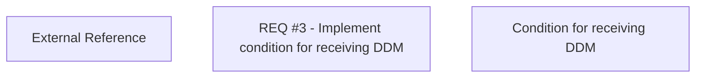

# REQ #3 - Implement condtion for retrieving DDM

- **Diagram Type**: Custom
- **Package**: HomerSelect/BSL/Requirements Model/Finished/CLM/CBL-4708 (CLM-2911) Scan Based Mandate Support in HOSEL
- **Diagram ID**: 127117
- **Elements**: 3
- **Connectors**: 0

