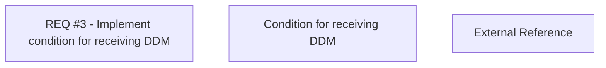

# REQ #3 - Implement condtion for retrieving DDM

```mermaid
graph TD
    REQ_3_Implement_condition_for_receiving_DDM["REQ #3 - Implement condition for receiving DDM"]
    Condition_for_receiving_DDM["Condition for receiving DDM"]
    External_Reference["External Reference"]
```
