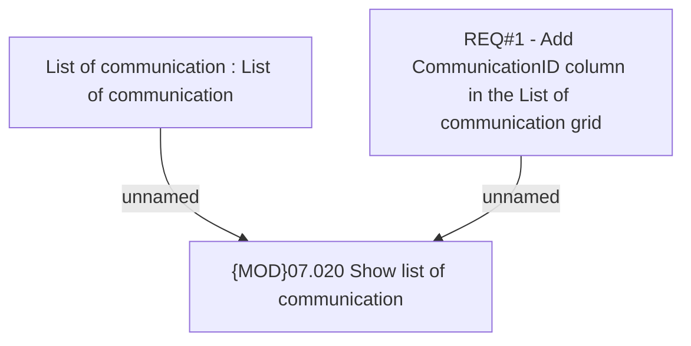

# CBL-4715 (CLM-1710) BSL Communications Identifier

```mermaid
graph TD
    REQ_1_Add_CommunicationID_column_in_the_List_of_communicatio["REQ#1 - Add CommunicationID column in the List of communication grid"]
    MOD_07_020_Show_list_of_communication["{MOD}07.020 Show list of communication"]
    List_of_communication_List_of_communication["List of communication : List of communication"]
    List_of_communication_List_of_communication -->|unnamed| MOD_07_020_Show_list_of_communication
    REQ_1_Add_CommunicationID_column_in_the_List_of_communicatio -->|unnamed| MOD_07_020_Show_list_of_communication
```
