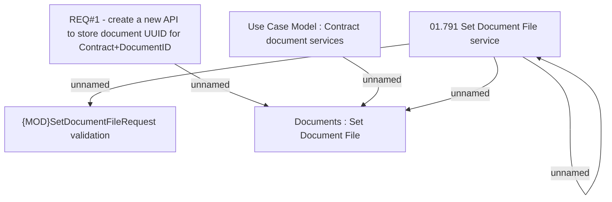

# CBL-4795 (CLM-1712) Create API to set document UID for document uploaded externaly to CAB

- **Diagram Type**: Custom
- **Package**: HomerSelect/BSL/Requirements Model/Finished/CLM/CBL-4795 (CLM-1712) Create API to set document UID for document uploaded externaly to CAB
- **Diagram ID**: 112259
- **Elements**: 6
- **Connectors**: 5

