# CBL-4814 (CLM-1713) Create Web Service for PER Request

- **Diagram Type**: Custom
- **Package**: HomerSelect/BSL/Requirements Model/Finished/CLM/CBL-4814 (CLM-1713) Create Web Service for PER Request
- **Diagram ID**: 119013
- **Elements**: 19
- **Connectors**: 16

```mermaid
graph TD
    CheckContractPERRequest_input_parameters["CheckContractPERRequest input parameters"]
    Partial_early_repayment_preview_Partial_early_repayment_prev["Partial early repayment preview : Partial early repayment preview"]
    Calculate_Minimal_New_PCA_after_PER["Calculate Minimal New PCA after PER"]
    Contract_PER_Service_Requests_Contract_PER_Service_Requests_["Contract PER Service Requests : Contract PER Service Requests - get preview"]
    Contract_PER_Service_Requests_Contract_PER_Service_Requests_["Contract PER Service Requests : Contract PER Service Requests - create request"]
    REQ_2_new_REST_API_for_PER_preview_and_request["REQ#2 - new REST API for PER preview and request"]
    REQ_1_Extract_common_parts_of_existing_PER_functionalities_t["REQ#1 - Extract common parts of existing PER functionalities to allow shared usage from GUI and API"]
    n_08_057_Perform_Partial_early_repayment["08.057 Perform Partial early repayment"]
    n_01_788_Create_ContractPERRequest_service["01.788 Create ContractPERRequest service"]
    n_01_787_Get_ContractPERRequest_preview_service["01.787 Get ContractPERRequest preview service"]
    n_01_788_Create_ContractPERRequest_service["01.788 Create ContractPERRequest service"]
    n_01_787_Get_ContractPERRequest_preview_service["01.787 Get ContractPERRequest preview service"]
    MOD_Check_PER_request_availability["{MOD}Check PER request availability"]
    ADD_08_051_Create_PER_request_common["{ADD}08.051 Create PER request common"]
    n_08_051_Create_PER_request_common["08.051 Create PER request common"]
    n_08_053_Create_PER_request_manually["08.053 Create PER request manually"]
    Calculate_Partial_ER_preview_Step2["Calculate Partial ER preview - Step2"]
    Calculate_Partial_ER_preview_Step1["Calculate Partial ER preview - Step1"]
    n_08_050_Show_Partial_ER_preview["08.050 Show Partial ER preview"]
    n_08_057_Perform_Partial_early_repayment -->|unnamed| Calculate_Minimal_New_PCA_after_PER
    n_01_787_Get_ContractPERRequest_preview_service -->|unnamed| Calculate_Partial_ER_preview_Step1
    n_01_787_Get_ContractPERRequest_preview_service -->|unnamed| CheckContractPERRequest_input_parameters
    n_01_787_Get_ContractPERRequest_preview_service -->|unnamed| n_01_787_Get_ContractPERRequest_preview_service
    n_01_787_Get_ContractPERRequest_preview_service -->|unnamed| Calculate_Partial_ER_preview_Step2
    n_01_788_Create_ContractPERRequest_service -->|unnamed| Calculate_Partial_ER_preview_Step1
    n_01_788_Create_ContractPERRequest_service -->|unnamed| n_08_051_Create_PER_request_common
    n_01_788_Create_ContractPERRequest_service -->|unnamed| n_01_788_Create_ContractPERRequest_service
    n_01_788_Create_ContractPERRequest_service -->|unnamed| Calculate_Partial_ER_preview_Step2
    n_01_788_Create_ContractPERRequest_service -->|unnamed| CheckContractPERRequest_input_parameters
    Calculate_Partial_ER_preview_Step1 -->|unnamed| MOD_Check_PER_request_availability
    Calculate_Partial_ER_preview_Step1 -->|unnamed| Calculate_Minimal_New_PCA_after_PER
    n_08_053_Create_PER_request_manually -->|unnamed| n_08_051_Create_PER_request_common
    n_08_051_Create_PER_request_common -->|unnamed| ADD_08_051_Create_PER_request_common
    n_08_050_Show_Partial_ER_preview -->|unnamed| Calculate_Partial_ER_preview_Step1
    n_08_050_Show_Partial_ER_preview -->|unnamed| Calculate_Partial_ER_preview_Step2
```

