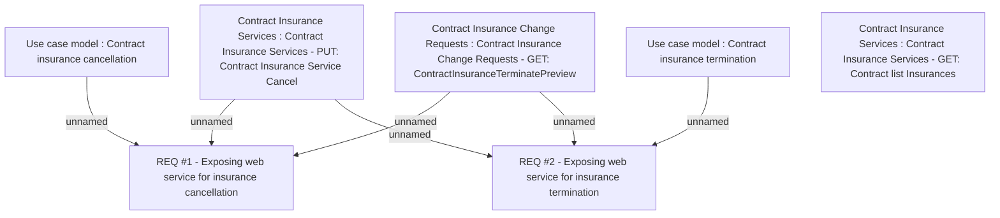

# CBL-4834 (CLM-1782) API for Insurance Cancellation and Termination

- **Diagram Type**: Custom
- **Package**: HomerSelect/BSL/Requirements Model/Finished/CLM/CBL-4834 (CLM-1782) API for Insurance Cancellation and Termination
- **Diagram ID**: 112151
- **Elements**: 9
- **Connectors**: 6

