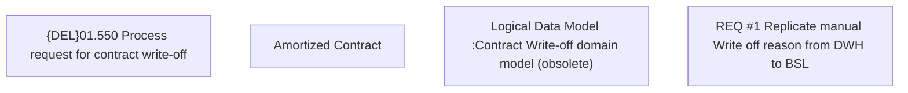

# CBL-4872 (CLM-1732) Manual Write Off Reason From DWH to BSL

- **Diagram Type**: Custom
- **Package**: HomerSelect/BSL/Requirements Model/Finished/CLM/CBL-4872 (CLM-1732) Manual Write Off Reason From DWH to BSL
- **Diagram ID**: 121000
- **Elements**: 4
- **Connectors**: 0

