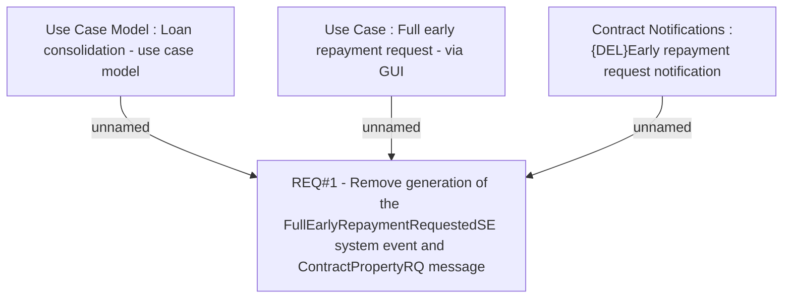

# CBL-4908 (CLM-1742) Stopping support of ContractPropertyServiceService calling

- **Diagram Type**: Custom
- **Package**: HomerSelect/BSL/Requirements Model/Finished/CLM/CBL-4908 (CLM-1742) Stopping support of ContractPropertyServiceService calling
- **Diagram ID**: 116903
- **Elements**: 4
- **Connectors**: 3

