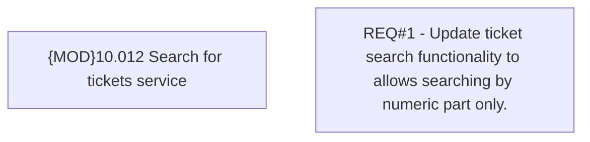

# CBL-4917 (CLM-1755) Change Ticketing Searching Criteria

- **Diagram Type**: Custom
- **Package**: HomerSelect/BSL/Requirements Model/Finished/CLM/CBL-4917 (CLM-1755) Change Ticketing Searching Criteria
- **Diagram ID**: 112122
- **Elements**: 2
- **Connectors**: 0

