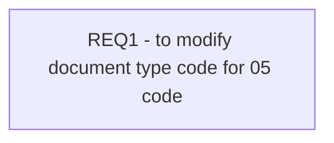

# CBL-4953 (CLM-1765) Modification of document type code for auto scan upload of documents

- **Diagram Type**: Custom
- **Package**: HomerSelect/BSL/Requirements Model/Finished/CLM/CBL-4953 (CLM-1765) Modification of document type code for auto scan upload of documents
- **Diagram ID**: 111360
- **Elements**: 1
- **Connectors**: 0

