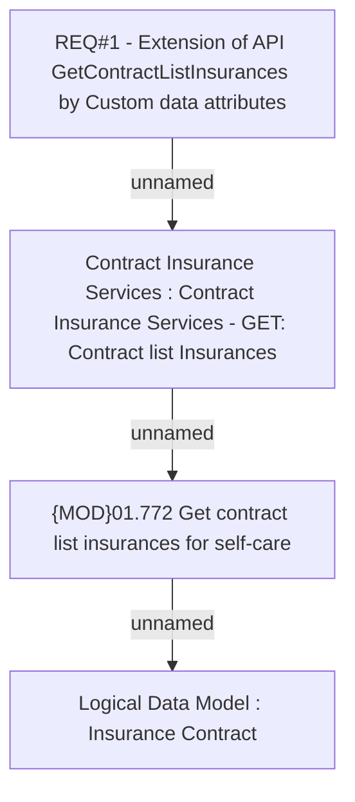

# CBL-4968 (CLM-1779) Extension of Self-Care API GetContractListInsurances by Custom data attributes

- **Diagram Type**: Custom
- **Package**: HomerSelect/BSL/Requirements Model/Finished/CLM/CBL-4968 (CLM-1779) Extension of Self-Care API GetContractListInsurances by Custom data attributes
- **Diagram ID**: 113129
- **Elements**: 4
- **Connectors**: 3

