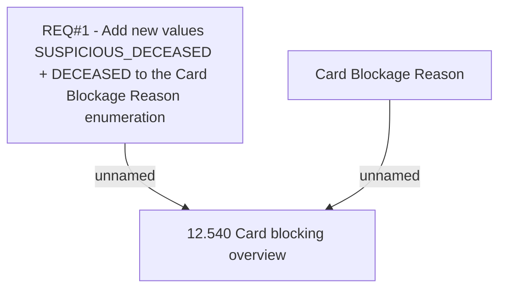

# CBL-4989 (CLM-1819) Add New Block Types for Deceased Customer

```mermaid
graph TD
    Card_Blockage_Reason["Card Blockage Reason"]
    n_12_540_Card_blocking_overview["12.540 Card blocking overview"]
    REQ_1_Add_new_values_SUSPICIOUS_DECEASED_DECEASED_to_the_Car["REQ#1 - Add new values SUSPICIOUS_DECEASED + DECEASED to the Card Blockage Reason enumeration"]
    REQ_1_Add_new_values_SUSPICIOUS_DECEASED_DECEASED_to_the_Car -->|unnamed| n_12_540_Card_blocking_overview
    Card_Blockage_Reason -->|unnamed| n_12_540_Card_blocking_overview
```
