# CBL-5005 (CLM-2546) Document Purpose needed for client documents for CLX Loans

- **Diagram Type**: Custom
- **Package**: HomerSelect/BSL/Requirements Model/Finished/CLM/CBL-5005 (CLM-2546) Document Purpose needed for client documents for CLX Loans
- **Diagram ID**: 122061
- **Elements**: 18
- **Connectors**: 12

```mermaid
graph TD
    SettingDocumentProofCheck_v1_SettingDocumentProofCheck_v1["SettingDocumentProofCheck_v1 : SettingDocumentProofCheck_v1"]
    User_Interface_Model_Document_registration_form["User Interface Model : Document registration form"]
    el_1463762["Note"]
    REQ_3_Contract_registration_document_for_checking_change["REQ#3 - Contract registration - document for checking change"]
    User_Interface_Model_View_and_download_stored_document["User Interface Model : View and download stored document"]
    UseCase_Model_Document_checking_within_contract_registration["UseCase Model : Document checking within contract registration"]
    ContractDocuments_ContractDocumentWS_Create_document["ContractDocuments :ContractDocumentWS - Create document"]
    ContractDocuments_ContractDocumentWS_Update_document["ContractDocuments : ContractDocumentWS - Update document"]
    ContractDocuments_ContractDocumentWS_GetDocumentsForRegistra["ContractDocuments : ContractDocumentWS - GetDocumentsForRegistration"]
    ContractDocuments_ContractDocumentWS_GetDocumentList["ContractDocuments : ContractDocumentWS - GetDocumentList"]
    REQ_5_Document_SOAP_API_modification["REQ#5 - Document SOAP API modification"]
    REQ_2_Document_management_user_interface_modification["REQ#2 - Document management - user interface modification"]
    REQ_4_Document_REST_API_redesign["REQ#4 - Document REST API redesign"]
    Documents_Get_Contract_Documents_detail["Documents : Get Contract Documents detail"]
    Logical_Data_Model_Document_Type["Logical Data Model : Document Type"]
    Logical_Data_Model_Document["Logical Data Model : Document "]
    UseCase_Model_Document_proof_check_use_case_model["UseCase Model : Document proof check - use case model"]
    REQ_1_Redesign_of_Document_Proof_Check["REQ#1 - Redesign of Document Proof Check"]
    Logical_Data_Model_Document_Type -->|unnamed| REQ_1_Redesign_of_Document_Proof_Check
    Logical_Data_Model_Document -->|unnamed| REQ_1_Redesign_of_Document_Proof_Check
    SettingDocumentProofCheck_v1_SettingDocumentProofCheck_v1 -->|unnamed| REQ_4_Document_REST_API_redesign
    Documents_Get_Contract_Documents_detail -->|unnamed| REQ_4_Document_REST_API_redesign
    User_Interface_Model_View_and_download_stored_document -->|unnamed| REQ_2_Document_management_user_interface_modification
    UseCase_Model_Document_proof_check_use_case_model -->|unnamed| REQ_2_Document_management_user_interface_modification
    ContractDocuments_ContractDocumentWS_Create_document -->|unnamed| REQ_5_Document_SOAP_API_modification
    ContractDocuments_ContractDocumentWS_Update_document -->|unnamed| REQ_5_Document_SOAP_API_modification
    ContractDocuments_ContractDocumentWS_GetDocumentsForRegistra -->|unnamed| REQ_5_Document_SOAP_API_modification
    ContractDocuments_ContractDocumentWS_GetDocumentList -->|unnamed| REQ_5_Document_SOAP_API_modification
    REQ_3_Contract_registration_document_for_checking_change -->|unnamed| UseCase_Model_Document_checking_within_contract_registration
    User_Interface_Model_Document_registration_form -->|unnamed| REQ_3_Contract_registration_document_for_checking_change
```

