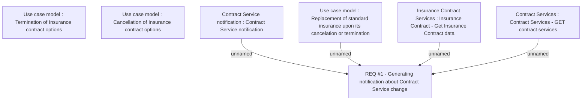

# CBL-5024 (CLM-1786) Notification message to Contract Insurance change

```mermaid
graph TD
    Use_case_model_Termination_of_Insurance_contract_options["Use case model : Termination of Insurance contract options"]
    Use_case_model_Cancellation_of_Insurance_contract_options["Use case model : Cancellation of Insurance contract options"]
    Contract_Services_Contract_Services_GET_contract_services["Contract Services : Contract Services - GET contract services"]
    Insurance_Contract_Services_Insurance_Contract_Get_Insurance["Insurance Contract Services : Insurance Contract - Get Insurance Contract data"]
    Use_case_model_Replacement_of_standard_insurance_upon_its_ca["Use case model : Replacement of standard insurance upon its cancelation or termination"]
    Contract_Service_notification_Contract_Service_notification["Contract Service notification : Contract Service notification"]
    REQ_1_Generating_notification_about_Contract_Service_change["REQ #1 - Generating notification about Contract Service change"]
    Contract_Service_notification_Contract_Service_notification -->|unnamed| REQ_1_Generating_notification_about_Contract_Service_change
    Use_case_model_Replacement_of_standard_insurance_upon_its_ca -->|unnamed| REQ_1_Generating_notification_about_Contract_Service_change
    Insurance_Contract_Services_Insurance_Contract_Get_Insurance -->|unnamed| REQ_1_Generating_notification_about_Contract_Service_change
    Contract_Services_Contract_Services_GET_contract_services -->|unnamed| REQ_1_Generating_notification_about_Contract_Service_change
```
