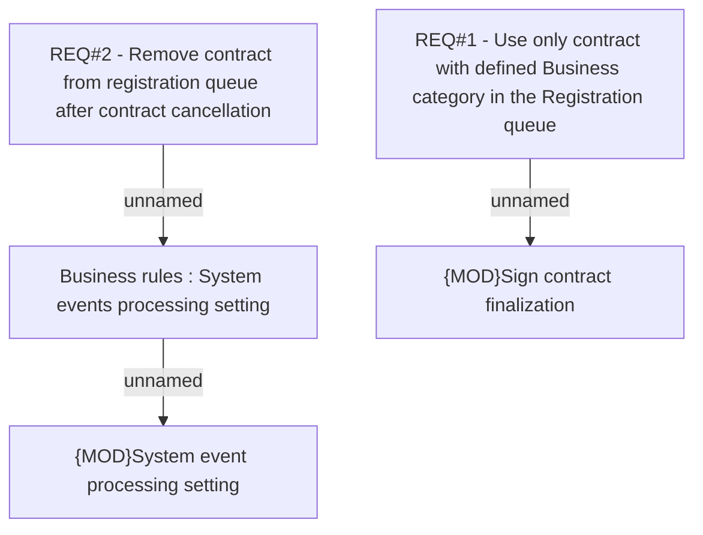

# CBL-5042 (CLM-1780) Registration queue cleaning

- **Diagram Type**: Custom
- **Package**: HomerSelect/BSL/Requirements Model/Finished/CLM/CBL-5042 (CLM-1780) Registration queue cleaning
- **Diagram ID**: 112152
- **Elements**: 5
- **Connectors**: 3

