# CBL-5043 (CLM-1778) A new CreateDocument method in ContractDocumentWS

- **Diagram Type**: Custom
- **Package**: HomerSelect/BSL/Requirements Model/Finished/CLM/CBL-5043 (CLM-1778) A new CreateDocument method in ContractDocumentWS
- **Diagram ID**: 117158
- **Elements**: 13
- **Connectors**: 7

```mermaid
graph TD
    CreateDocumentRequest_validations["CreateDocumentRequest validations"]
    UseCase_Model_Edit_DDM_documents["UseCase Model : Edit DDM documents"]
    UseCase_Model_Edit_contract_documents["UseCase Model : Edit contract documents"]
    UseCase_Model_Edit_client_documents["UseCase Model : Edit client documents"]
    ADD_01_108_Add_DDM_document_common["{ADD}01.108 Add DDM document common"]
    n_01_108_Add_DDM_document_common["01.108 Add DDM document common"]
    n_01_107_Add_contract_document_common["01.107 Add contract document common"]
    ADD_01_107_Add_document_common["{ADD}01.107 Add document common"]
    n_01_106_Add_client_document_common["01.106 Add client document common"]
    ADD_01_106_Add_client_document_common["{ADD}01.106 Add client document common"]
    ContractDocuments_ADD_ContractDocumentWS_Create_document["ContractDocuments : {ADD}ContractDocumentWS - Create document"]
    REQ_1_Add_new_CreateDocument_method_in_ContractDocumentWS["REQ#1 - Add new CreateDocument method in ContractDocumentWS"]
    Logical_Data_Model_Contract_Document["Logical Data Model : Contract - Document"]
    REQ_1_Add_new_CreateDocument_method_in_ContractDocumentWS -->|unnamed| ContractDocuments_ADD_ContractDocumentWS_Create_document
    REQ_1_Add_new_CreateDocument_method_in_ContractDocumentWS -->|unnamed| UseCase_Model_Edit_client_documents
    REQ_1_Add_new_CreateDocument_method_in_ContractDocumentWS -->|unnamed| UseCase_Model_Edit_contract_documents
    REQ_1_Add_new_CreateDocument_method_in_ContractDocumentWS -->|unnamed| UseCase_Model_Edit_DDM_documents
    n_01_108_Add_DDM_document_common -->|unnamed| ADD_01_108_Add_DDM_document_common
    n_01_106_Add_client_document_common -->|unnamed| ADD_01_106_Add_client_document_common
    n_01_107_Add_contract_document_common -->|unnamed| ADD_01_107_Add_document_common
```

