# CBL-5151 (CLM-1871) Add ConditionAcceptedSE/RejectedSE to ContractFullInfo Notification

- **Diagram Type**: Custom
- **Package**: HomerSelect/BSL/Requirements Model/Finished/CLM/CBL-5151 (CLM-1871) Add ConditionAcceptedSE/RejectedSE to ContractFullInfo Notification
- **Diagram ID**: 115449
- **Elements**: 14
- **Connectors**: 6

```mermaid
graph TD
    External_Reference["External Reference"]
    External_Reference["External Reference"]
    DEL_01_252_Evaluate_Contract_Service_Parameters["{DEL}01.252 Evaluate Contract Service Parameters"]
    DEL_01_712_Finish_contract_on_service_execution["{DEL}01.712 Finish contract on service execution"]
    Set_Contract_Condition_Rejected["Set Contract Condition Rejected"]
    n_08_925_Cancel_expired_loan_service_requests["08.925 Cancel expired loan service requests"]
    MOD_05_310_Process_disbursement_confirmations["{MOD}05.310 Process disbursement confirmations"]
    Contract_Notifications_Contract_Full_Info_notification["Contract Notifications : Contract Full Info notification"]
    MOD_System_event_processing_setting["{MOD}System event processing setting"]
    MOD_05_350_Process_disbursement_confirmation_message["{MOD}05.350 Process disbursement confirmation message"]
    MOD_Sign_contract_finalization["{MOD}Sign contract finalization"]
    Set_contract_Condition_Accepted["Set contract Condition Accepted"]
    REQ_2_Add_ConditionAcceptedSE_and_ConditionRejectedSE_to_Con["REQ#2 -  Add ConditionAcceptedSE and ConditionRejectedSE  to ContractFullInfo Notification"]
    REQ_1_Add_ConditionAcceptedSE_and_ConditionRejectedSE_events["REQ#1 -  Add ConditionAcceptedSE and ConditionRejectedSE events"]
    MOD_Sign_contract_finalization -->|unnamed| Set_contract_Condition_Accepted
    n_08_925_Cancel_expired_loan_service_requests -->|unnamed| Set_Contract_Condition_Rejected
    MOD_05_350_Process_disbursement_confirmation_message -->|unnamed| Set_contract_Condition_Accepted
    MOD_05_350_Process_disbursement_confirmation_message -->|unnamed| Set_Contract_Condition_Rejected
    MOD_05_310_Process_disbursement_confirmations -->|unnamed| Set_Contract_Condition_Rejected
    MOD_05_310_Process_disbursement_confirmations -->|unnamed| Set_contract_Condition_Accepted
```

