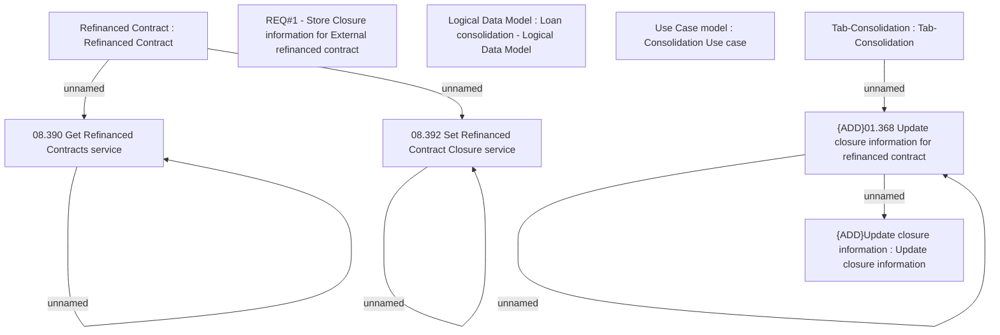

# CBL-5168 (CLM-2062) External Refinance contract closure information

- **Diagram Type**: Custom
- **Package**: HomerSelect/BSL/Requirements Model/Finished/CLM/CBL-5168 (CLM-2062) External Refinance contract closure information
- **Diagram ID**: 117604
- **Elements**: 12
- **Connectors**: 7

