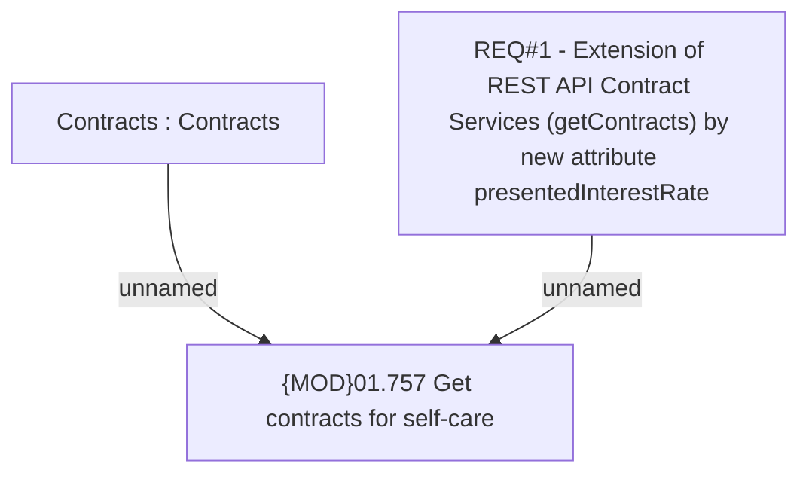

# CBL-5169 (CLM-1837) Add PIR parameter to getContracts Rest API

```mermaid
graph TD
    REQ_1_Extension_of_REST_API_Contract_Services_getContracts_b["REQ#1 - Extension of REST API Contract Services (getContracts) by new attribute presentedInterestRate"]
    MOD_01_757_Get_contracts_for_self_care["{MOD}01.757 Get contracts for self-care"]
    Contracts_Contracts["Contracts : Contracts"]
    Contracts_Contracts -->|unnamed| MOD_01_757_Get_contracts_for_self_care
    REQ_1_Extension_of_REST_API_Contract_Services_getContracts_b -->|unnamed| MOD_01_757_Get_contracts_for_self_care
```
