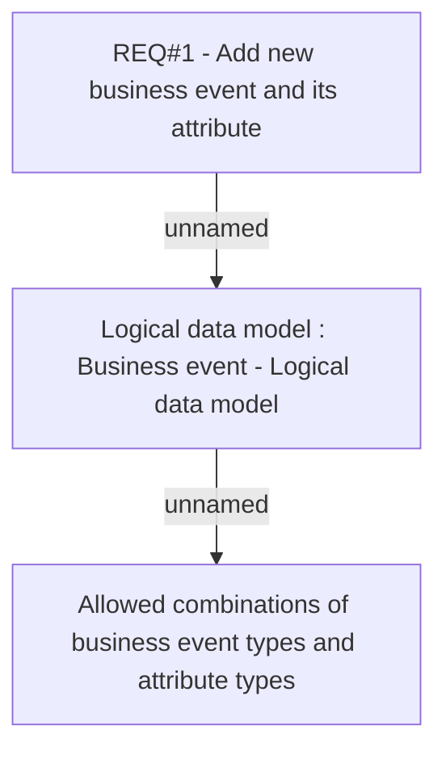

# CBL-5180 (CLM-1810) Add new business event & its attribute

- **Diagram Type**: Custom
- **Package**: HomerSelect/BSL/Requirements Model/Finished/CLM/CBL-5180 (CLM-1810) Add new business event & its attribute
- **Diagram ID**: 112774
- **Elements**: 3
- **Connectors**: 2

