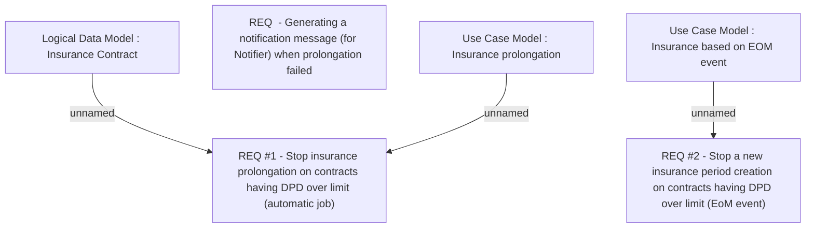

# CBL-5196 (CLM-1854) Stop insurance charging in collection

- **Diagram Type**: Custom
- **Package**: HomerSelect/BSL/Requirements Model/Finished/CLM/CBL-5196 (CLM-1854) Stop insurance charging in collection
- **Diagram ID**: 118809
- **Elements**: 6
- **Connectors**: 3

