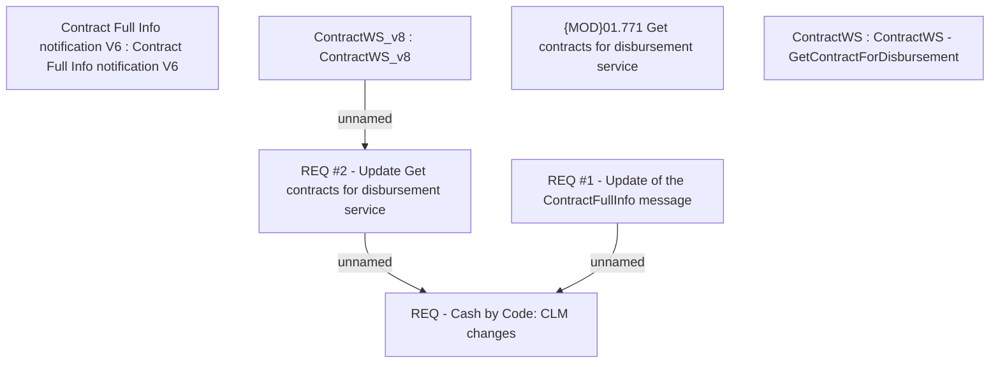

# CBL-5208 (CLM-3081) Cash by Code

- **Diagram Type**: Custom
- **Package**: HomerSelect/BSL/Requirements Model/Finished/CLM/CBL-5208 (CLM-3081) Cash by Code
- **Diagram ID**: 144804
- **Elements**: 7
- **Connectors**: 3

