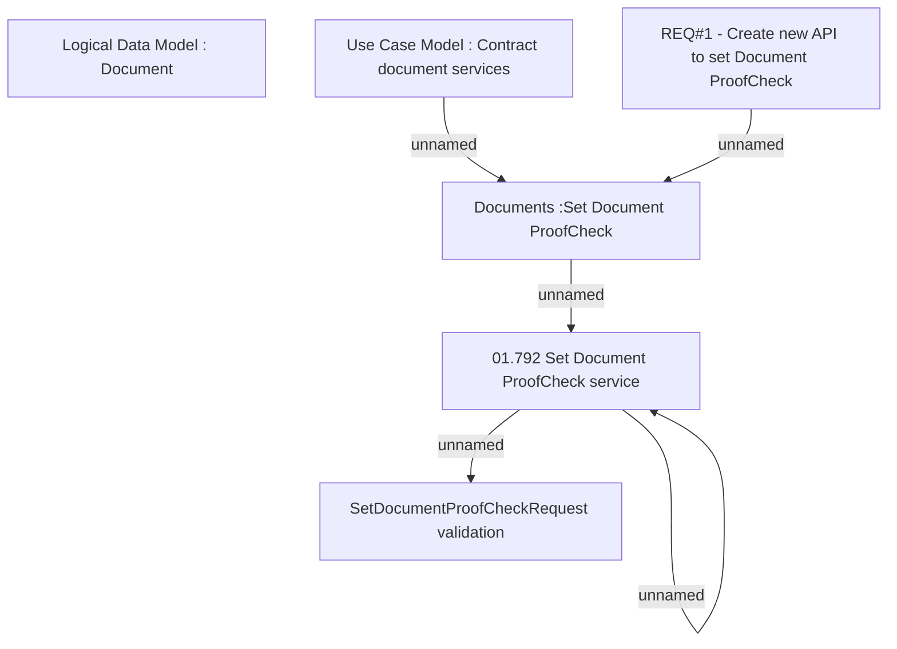

# CBL-5276 (CLM-1857) Create API to set Document Proof Check

```mermaid
graph TD
    Logical_Data_Model_Document["Logical Data Model : Document "]
    SetDocumentProofCheckRequest_validation["SetDocumentProofCheckRequest validation"]
    n_01_792_Set_Document_ProofCheck_service["01.792 Set Document ProofCheck service"]
    n_01_792_Set_Document_ProofCheck_service["01.792 Set Document ProofCheck service"]
    Documents_Set_Document_ProofCheck["Documents :Set Document ProofCheck"]
    Use_Case_Model_Contract_document_services["Use Case Model : Contract document services"]
    REQ_1_Create_new_API_to_set_Document_ProofCheck["REQ#1 - Create new API to set Document ProofCheck"]
    Use_Case_Model_Contract_document_services -->|unnamed| Documents_Set_Document_ProofCheck
    REQ_1_Create_new_API_to_set_Document_ProofCheck -->|unnamed| Documents_Set_Document_ProofCheck
    Documents_Set_Document_ProofCheck -->|unnamed| n_01_792_Set_Document_ProofCheck_service
    n_01_792_Set_Document_ProofCheck_service -->|unnamed| SetDocumentProofCheckRequest_validation
    n_01_792_Set_Document_ProofCheck_service -->|unnamed| n_01_792_Set_Document_ProofCheck_service
```
