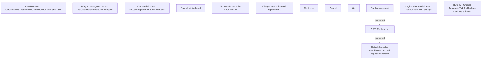

# CBL-5285 (CLM-1834) Change Automatic Tick for Replace Card Menu in BSL

```mermaid
graph TD
    CardBlockWS_CardBlockWS_GetAllowedCardBlockOperationsForUser["CardBlockWS : CardBlockWS.GetAllowedCardBlockOperationsForUser"]
    REQ_1_Integrate_method_GetCardReplacementCountRequest["REQ #1 - Integrate method GetCardReplacementCountRequest"]
    CardStatisticsWS_GetCardReplacementCountRequest["CardStatisticsWS : GetCardReplacementCountRequest"]
    Cancel_original_card["Cancel original card"]
    PIN_transfer_from_the_original_card["PIN transfer from the original card"]
    Charge_fee_for_the_card_replacement["Charge fee for the card replacement"]
    Card_type["Card type"]
    Cancel["Cancel"]
    OK["OK"]
    Card_replacement["Card replacement"]
    n_12_503_Replace_card["12.503 Replace card"]
    Get_attributes_for_checkboxes_on_Card_replacement_form["Get attributes for checkboxes on Card replacement form"]
    Logical_data_model_Card_replacement_form_settings["Logical data model : Card replacement form settings"]
    REQ_2_Change_Automatic_Tick_for_Replace_Card_Menu_in_BSL["REQ #2 - Change Automatic Tick for Replace Card Menu in BSL"]
    n_12_503_Replace_card -->|unnamed| Get_attributes_for_checkboxes_on_Card_replacement_form
    Card_replacement -->|unnamed| n_12_503_Replace_card
```
