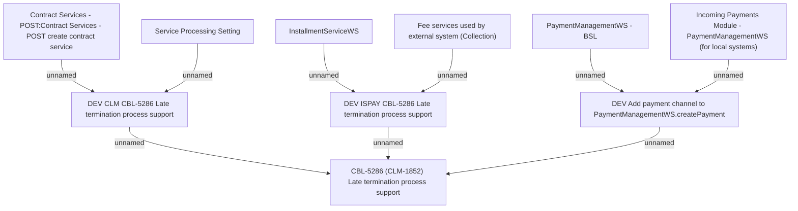

# CBL-5286 (CLM-1852) Late termination process support

- **Diagram Type**: Custom
- **Package**: HomerSelect/BSL/Requirements Model/Finished/CLM/CBL-5286 (CLM-1852) Late termination process support
- **Diagram ID**: 118929
- **Elements**: 10
- **Connectors**: 9

