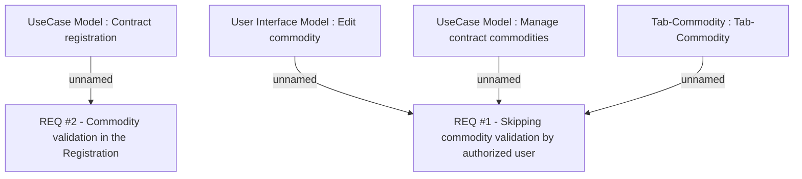

# CBL-5290 (CLM-1868) Skipping Commodity Validation functionality

- **Diagram Type**: Custom
- **Package**: HomerSelect/BSL/Requirements Model/Finished/CLM/CBL-5290 (CLM-1868) Skipping Commodity Validation functionality
- **Diagram ID**: 114351
- **Elements**: 6
- **Connectors**: 4

