# CBL-5303 (CLM-1856) Create API for CHDDR request

- **Diagram Type**: Custom
- **Package**: HomerSelect/BSL/Requirements Model/Finished/CLM/CBL-5303 (CLM-1856) Create API for CHDDR request
- **Diagram ID**: 120544
- **Elements**: 14
- **Connectors**: 7

```mermaid
graph TD
    ADD_08_064_Create_request_for_change_due_date_common["{ADD}08.064 Create request for change due date common"]
    MOD_08_062_Create_request_for_change_due_date["{MOD}08.062 Create request for change due date"]
    MOD_08_064_Create_request_for_change_due_date_common["{MOD}08.064 Create request for change due date common"]
    Contract_CHDDR_Service_Requests_Contract_CHDDR_Service_Reque["Contract CHDDR Service Requests : Contract CHDDR Service Requests - get preview"]
    Contract_CHDDR_Service_Requests_Contract_CHDDR_Service_Reque["Contract CHDDR Service Requests : Contract CHDDR Service Requests - create request"]
    ADD_Check_ContractCHDDRequest_input_parameters["{ADD}Check ContractCHDDRequest input parameters"]
    Use_Case_CHDDR_request_creation_via_GUI["Use Case : CHDDR request creation - via GUI"]
    Use_Case_CHDDR_request_creation_externally["Use Case : CHDDR request creation - externally"]
    n_01_795_Create_ContractCHDDRequest_service["01.795 Create ContractCHDDRequest service"]
    n_01_794_Get_ContractCHDDRequest_preview_service["01.794 Get ContractCHDDRequest preview service"]
    n_01_795_Create_ContractCHDDRequest_service["01.795 Create ContractCHDDRequest service"]
    n_01_794_Get_ContractCHDDRequest_preview_service["01.794 Get ContractCHDDRequest preview service"]
    REQ_2_new_REST_API_for_CHDDR_preview_and_request["REQ#2 - new REST API for CHDDR preview and request"]
    REQ_1_Extract_common_part_of_existing_CHDDR_functionalities_["REQ#1 - Extract common part of existing CHDDR functionalities to allow shared usage from GUI and API"]
    n_01_795_Create_ContractCHDDRequest_service -->|unnamed| n_01_795_Create_ContractCHDDRequest_service
    n_01_795_Create_ContractCHDDRequest_service -->|unnamed| MOD_08_064_Create_request_for_change_due_date_common
    n_01_795_Create_ContractCHDDRequest_service -->|unnamed| ADD_Check_ContractCHDDRequest_input_parameters
    n_01_794_Get_ContractCHDDRequest_preview_service -->|unnamed| n_01_794_Get_ContractCHDDRequest_preview_service
    n_01_794_Get_ContractCHDDRequest_preview_service -->|unnamed| ADD_Check_ContractCHDDRequest_input_parameters
    MOD_08_062_Create_request_for_change_due_date -->|unnamed| MOD_08_064_Create_request_for_change_due_date_common
    MOD_08_064_Create_request_for_change_due_date_common -->|unnamed| ADD_08_064_Create_request_for_change_due_date_common
```

