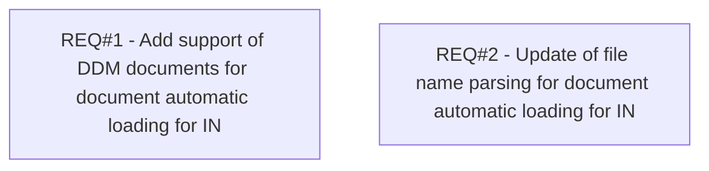

# CBL-5333 (CLM-1839) Addition of new document types for auto scan upload

- **Diagram Type**: Custom
- **Package**: HomerSelect/BSL/Requirements Model/Finished/CLM/CBL-5333 (CLM-1839) Addition of new document types for auto scan upload
- **Diagram ID**: 113132
- **Elements**: 2
- **Connectors**: 0

