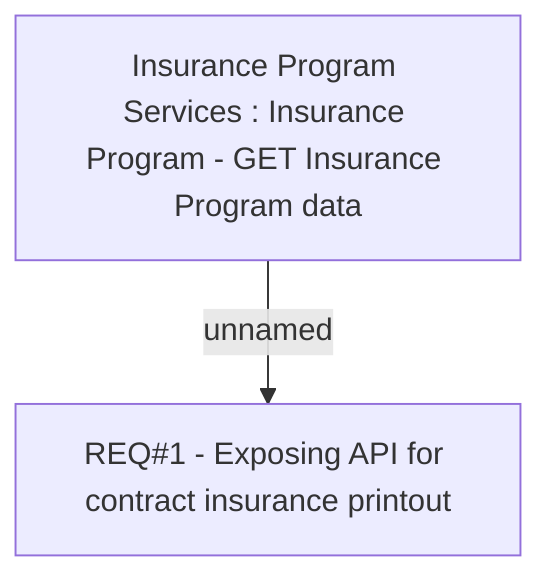

# CBL-5348 (CLM-1919) API for Insurance printout on Contract with Signed and Active Status

- **Diagram Type**: Custom
- **Package**: HomerSelect/BSL/Requirements Model/Finished/CLM/CBL-5348 (CLM-1919) API for Insurance printout on Contract with Signed and Active Status
- **Diagram ID**: 115708
- **Elements**: 2
- **Connectors**: 1

