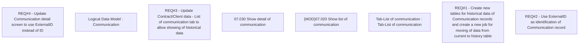

# CBL-5351 (CLM-1840) Archiving BSL Communication records

```mermaid
graph TD
    REQ_4_Update_Communication_detail_screen_to_use_ExternalID_i["REQ#4 - Update Communication detail screen to use ExternalID instead of ID"]
    Logical_Data_Model_Communication["Logical Data Model : Communication"]
    REQ_3_Update_Contract_Client_data_List_of_communication_tab_["REQ#3 - Update Contract/Client data - List of communication tab to allow showing of historical data"]
    n_07_030_Show_detail_of_communication["07.030 Show detail of communication"]
    MOD_07_020_Show_list_of_communication["{MOD}07.020 Show list of communication"]
    Tab_List_of_communication_Tab_List_of_communication["Tab-List of communication : Tab-List of communication"]
    REQ_1_Create_new_tables_for_historical_data_of_Communication["REQ#1 - Create new tables for historical data of Communication records and create a new job for moving of data from current to history table"]
    REQ_2_Use_ExternalID_as_identification_of_Communication_reco["REQ#2 - Use ExternalID as identification of Communication record"]
```
