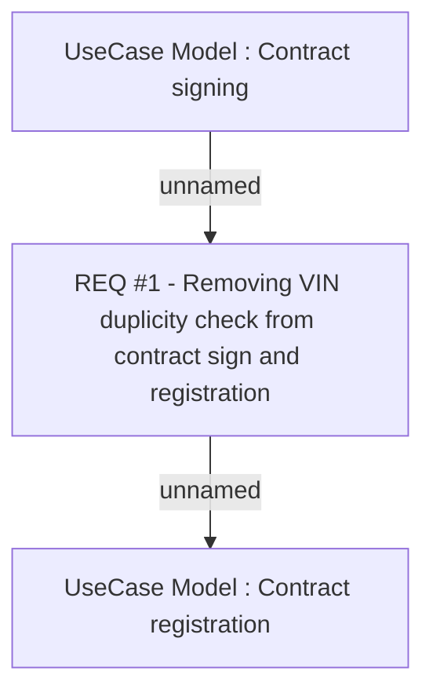

# CBL-5368 (CLM-2098) Removing VIN duplicity validation

- **Diagram Type**: Custom
- **Package**: HomerSelect/BSL/Requirements Model/Finished/CLM/CBL-5368 (CLM-2098) Removing VIN duplicity validation
- **Diagram ID**: 117321
- **Elements**: 3
- **Connectors**: 2

