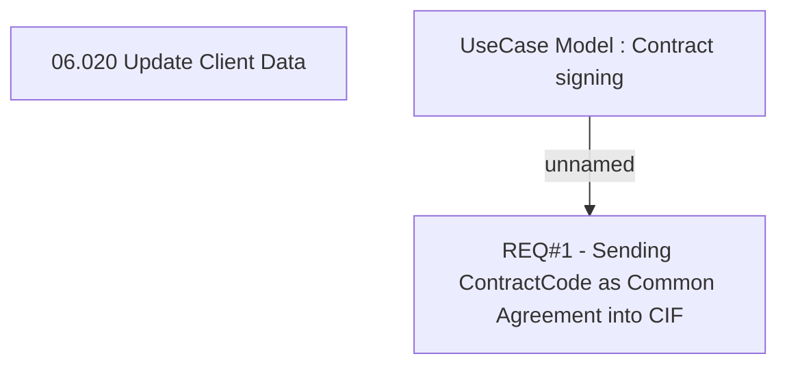

# CBL-5421 (CLM-1960) Common Agreement Attribute (Bank Service Agreement)

- **Diagram Type**: Custom
- **Package**: HomerSelect/BSL/Requirements Model/Finished/CLM/CBL-5421 (CLM-1960) Common Agreement Attribute (Bank Service Agreement)
- **Diagram ID**: 115705
- **Elements**: 3
- **Connectors**: 1

