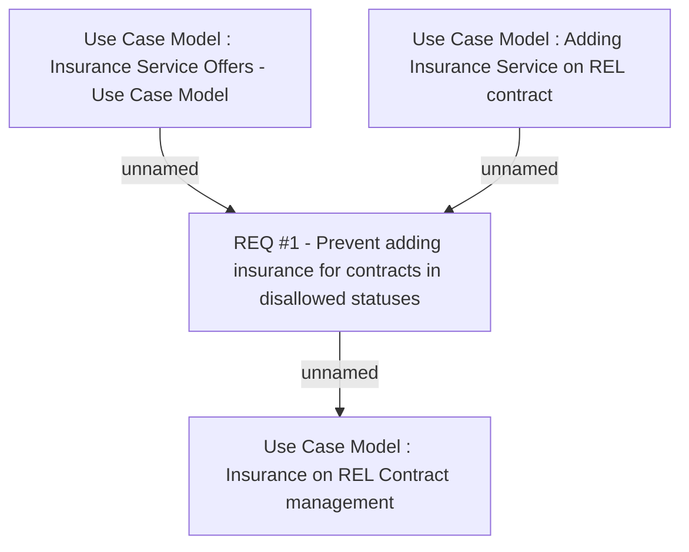

# CBL-5433 (CLM-1961) Stop charging premium insurance for Paid-off/Written-off REL contracts

- **Diagram Type**: Custom
- **Package**: HomerSelect/BSL/Requirements Model/Finished/CLM/CBL-5433 (CLM-1961) Stop charging premium insurance for Paid-off/Written-off REL contracts
- **Diagram ID**: 119099
- **Elements**: 4
- **Connectors**: 3

