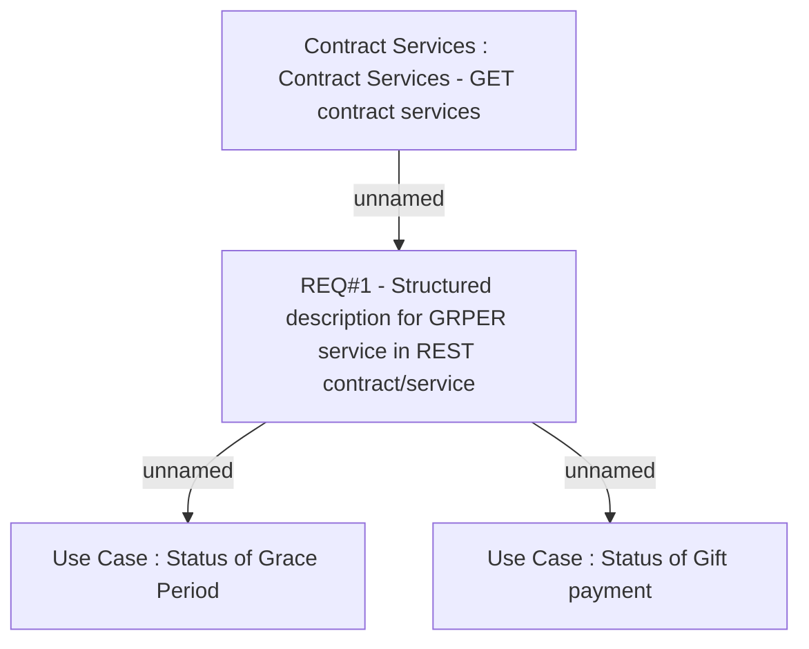

# CBL-5436 (CLM-1958) Change serviceConditionsDescription to be structured in REST contract-service

- **Diagram Type**: Custom
- **Package**: HomerSelect/BSL/Requirements Model/Finished/CLM/CBL-5436 (CLM-1958) Change serviceConditionsDescription to be structured in REST contract-service
- **Diagram ID**: 116594
- **Elements**: 4
- **Connectors**: 3

