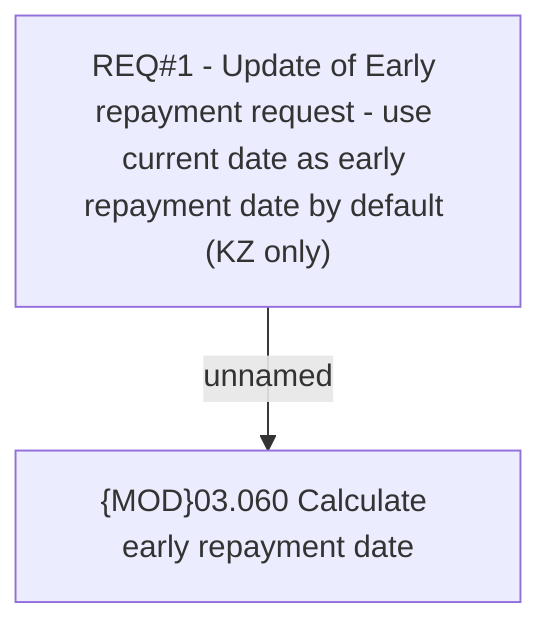

# CBL-5505 (CLM-1935) FER early repayment date by default

- **Diagram Type**: Custom
- **Package**: HomerSelect/BSL/Requirements Model/Finished/CLM/CBL-5505 (CLM-1935) FER early repayment date by default
- **Diagram ID**: 116904
- **Elements**: 2
- **Connectors**: 1

