# Debt Catalog (DC) to trigger contract finishing evaluation (IS-639)

- **Diagram Type**: Custom
- **Package**: HomerSelect/BSL/Requirements Model/Finished/CLM/CBL-5507 (CLM-2841) Simultaneous processing of regular jobs and payment pairing 
- **Diagram ID**: 144826
- **Elements**: 35
- **Connectors**: 7

```mermaid
graph TD
    DEL_01_252_Evaluate_Contract_Service_Parameters["{DEL}01.252 Evaluate Contract Service Parameters"]
    MOD_01_715_Finish_contract_automatically["{MOD}01.715 Finish contract automatically"]
    n_01_711_Accept_conditions_for_SAI_contract["01.711 Accept conditions for SAI contract"]
    DEL_01_713_Finish_registered_contract_on_service_execution["{DEL}01.713 Finish registered contract on service execution"]
    DEL_01_712_Finish_contract_on_service_execution["{DEL}01.712 Finish contract on service execution"]
    MOD_01_714_Process_contract_registering_and_finishing["{MOD}01.714 Process contract registering and finishing"]
    DEL_01_482_Update_debt_statistics["{DEL}01.482 Update debt statistics"]
    n_01_477_Process_debt_catalogue_requests_job["01.477 Process debt catalogue requests job"]
    MOD_01_475_Update_overdue_debt_in_job["{MOD}01.475 Update overdue debt in job"]
    n_01_476_Process_contract_debt_change_request["01.476 Process contract debt change request"]
    Call_updateDebtStatistics_after_finishing_of_debtCataloguePr["Call updateDebtStatistics after finishing of debtCatalogueProcessing job"]
    MOD_Process_ContractRegistrationSE["{MOD}Process ContractRegistrationSE"]
    CELAccountBalanceChangedInternalSE["CELAccountBalanceChangedInternalSE"]
    n_05_081_Create_small_underpayment["05.081 Create small underpayment"]
    n_05_081_Create_small_underpayment["05.081 Create small underpayment"]
    ADD_Process_CELAccountBalanceChangedInternalSE["{ADD}Process CELAccountBalanceChangedInternalSE"]
    DEL_Process_CELAccountBalanceChangedSE["{DEL}Process CELAccountBalanceChangedSE"]
    MOD_Process_LoanServiceRequestExecutedSE["{MOD}Process LoanServiceRequestExecutedSE"]
    ADD_01_711_Accept_conditions_for_SAI_contract["{ADD}01.711 Accept conditions for SAI contract"]
    Technical_Global_Parameter["Technical Global Parameter"]
    Use_Case_Model_AD_05_180_Perform_coupling_payments_with_inst["Use Case Model : AD - 05.180 Perform coupling payments with instalments"]
    UseCase_Model_Contract_debt_tracking["UseCase Model : Contract debt tracking"]
    n_01_360_Cancel_contract["01.360 Cancel contract"]
    n_01_502_Pay_off_CEL_contract["01.502 Pay-off CEL contract"]
    MOD_05_180_Perform_coupling_payments_with_instalments["{MOD}05.180 Perform coupling payments with instalments"]
    MOD_01_191_Process_installment_schedule_generation_after_dis["{MOD}01.191 Process installment schedule generation after disbursement"]
    MOD_Update_data_in_contract_related_structures["{MOD}Update data in contract related structures"]
    Remove_debt_checks_from_contract_finishing["Remove debt checks from contract finishing"]
    Separate_SAI_condition_acceptance["Separate SAI condition acceptance"]
    Implement_switches_for_calling_Debt_Catalog_recalculation_as["Implement switches for calling Debt Catalog recalculation asynchronously"]
    Debt_Catalog_DC_to_trigger_contract_finishing_evaluation["Debt Catalog (DC) to trigger contract finishing evaluation"]
    REQ_1["REQ 1"]
    REQ_2["REQ 2"]
    REQ_3["REQ 3"]
    REQ_4["REQ 4"]
    Remove_debt_checks_from_contract_finishing -->|unnamed| Debt_Catalog_DC_to_trigger_contract_finishing_evaluation
    Call_updateDebtStatistics_after_finishing_of_debtCataloguePr -->|unnamed| Debt_Catalog_DC_to_trigger_contract_finishing_evaluation
    Separate_SAI_condition_acceptance -->|unnamed| Debt_Catalog_DC_to_trigger_contract_finishing_evaluation
    Implement_switches_for_calling_Debt_Catalog_recalculation_as -->|unnamed| Debt_Catalog_DC_to_trigger_contract_finishing_evaluation
    ADD_Process_CELAccountBalanceChangedInternalSE -->|unnamed| n_05_081_Create_small_underpayment
    n_05_081_Create_small_underpayment -->|unnamed| n_05_081_Create_small_underpayment
    CELAccountBalanceChangedInternalSE -->|unnamed| ADD_Process_CELAccountBalanceChangedInternalSE
```

