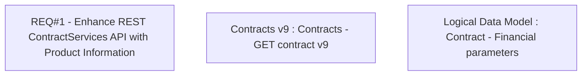

# CBL-5547 (CLM-1962) Enhance REST ContractServices API with Product Information

```mermaid
graph TD
    REQ_1_Enhance_REST_ContractServices_API_with_Product_Informa["REQ#1 - Enhance REST ContractServices API with Product Information"]
    Contracts_v9_Contracts_GET_contract_v9["Contracts v9 : Contracts - GET contract v9"]
    Logical_Data_Model_Contract_Financial_parameters["Logical Data Model : Contract - Financial parameters"]
```
