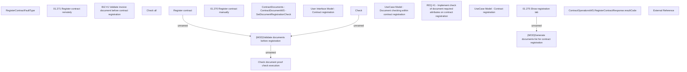

# CBL-5553 (CLM-2773) INVOICE document for Key Accounts/Home Appliances

```mermaid
graph TD
    Check_document_proof_check_execution["Check document proof check execution"]
    RegisterContractFaultType["RegisterContractFaultType"]
    n_01_271_Register_contract_remotely["01.271 Register contract remotely"]
    BIZ_1_Validate_invoice_document_before_contract_registration["BIZ #1 Validate invoice document before contract registration"]
    Check_all["Check all"]
    Check["Check"]
    MOD_Validate_documents_before_registration["{MOD}Validate documents before registration"]
    n_01_270_Register_contract_manually["01.270 Register contract manually"]
    MOD_Generate_documents_list_for_contract_registration["{MOD}Generate documents list for contract registration"]
    ContractDocuments_ContractDocumentWS_SetDocumentRegistration["ContractDocuments : ContractDocumentWS - SetDocumentRegistrationCheck"]
    User_Interface_Model_Contract_registration["User Interface Model : Contract registration"]
    Register_contract["Register contract"]
    UseCase_Model_Document_checking_within_contract_registration["UseCase Model : Document checking within contract registration"]
    REQ_1_Implement_check_of_document_required_attributes_on_con["REQ #1 - Implement check of document required attributes on contract registration"]
    UseCase_Model_Contract_registration["UseCase Model : Contract registration"]
    n_01_275_Show_registration_tab["01.275 Show registration tab"]
    ContractOperationsWS_RegisterContractResponse_resultCode["ContractOperationsWS.RegisterContractResponse.resultCode"]
    External_Reference["External Reference"]
    Register_contract -->|unnamed| MOD_Validate_documents_before_registration
    Check -->|unnamed| MOD_Validate_documents_before_registration
    n_01_275_Show_registration_tab -->|unnamed| MOD_Generate_documents_list_for_contract_registration
    MOD_Validate_documents_before_registration -->|unnamed| Check_document_proof_check_execution
```
