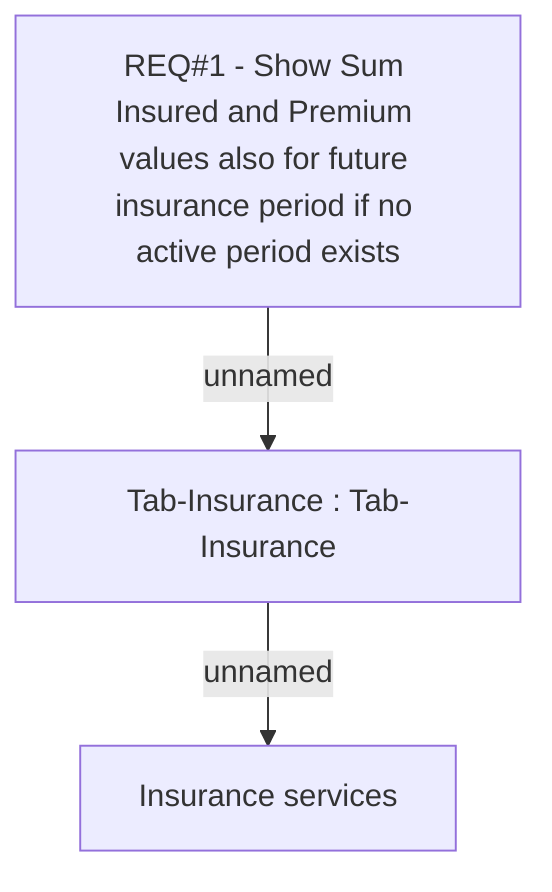

# CBL-5562 (CLM-1908) Update visibilty of Sum Insured and Premium values for future insurance period

- **Diagram Type**: Custom
- **Package**: HomerSelect/BSL/Requirements Model/Finished/CLM/CBL-5562 (CLM-1908) Update visibilty of Sum Insured and Premium values for future insurance period
- **Diagram ID**: 128497
- **Elements**: 3
- **Connectors**: 2

