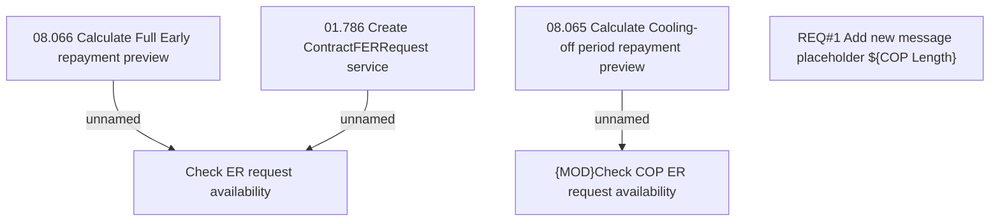

# CBL-5648 (CLM-2018) Transaltions for FER, COP

- **Diagram Type**: Custom
- **Package**: HomerSelect/BSL/Requirements Model/Finished/CLM/CBL-5648 (CLM-2018) Transaltions for FER, COP
- **Diagram ID**: 119396
- **Elements**: 6
- **Connectors**: 3

