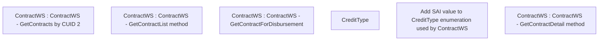

# CBL-5692 (CLM-1932) Add SAI contract type into ContractWS

```mermaid
graph TD
    ContractWS_ContractWS_GetContracts_by_CUID_2["ContractWS : ContractWS - GetContracts by CUID 2"]
    ContractWS_ContractWS_GetContractList_method["ContractWS : ContractWS - GetContractList method"]
    ContractWS_ContractWS_GetContractForDisbursement["ContractWS : ContractWS - GetContractForDisbursement"]
    CreditType["CreditType"]
    Add_SAI_value_to_CreditType_enumeration_used_by_ContractWS["Add SAI value to CreditType enumeration used by ContractWS"]
    ContractWS_ContractWS_GetContractDetail_method["ContractWS : ContractWS - GetContractDetail method"]
```
