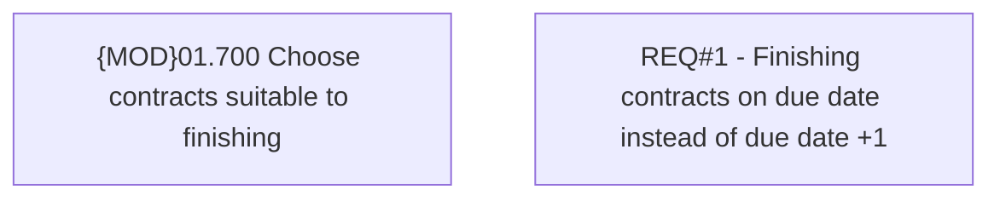

# CBL-5851 (CLM-1993) Finishing contracts on due date

- **Diagram Type**: Custom
- **Package**: HomerSelect/BSL/Requirements Model/Finished/CLM/CBL-5851 (CLM-1993) Finishing contracts on due date
- **Diagram ID**: 115709
- **Elements**: 2
- **Connectors**: 0

