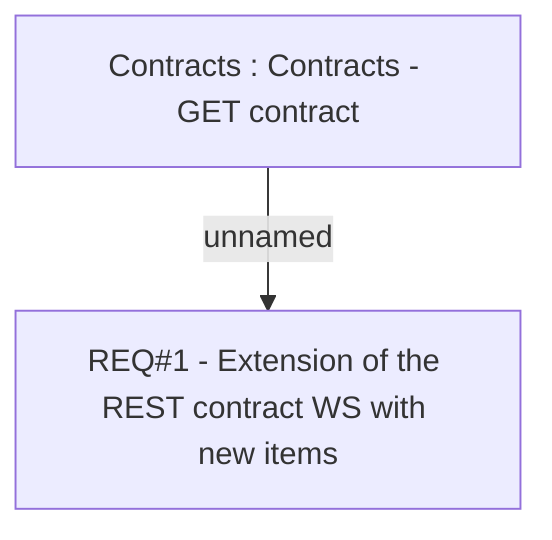

# CBL-5974 (CLM-2045) REST Contract enhancement for Vectors fullpath

```mermaid
graph TD
    Contracts_Contracts_GET_contract["Contracts : Contracts - GET contract"]
    REQ_1_Extension_of_the_REST_contract_WS_with_new_items["REQ#1 - Extension of the REST contract WS with new items"]
    Contracts_Contracts_GET_contract -->|unnamed| REQ_1_Extension_of_the_REST_contract_WS_with_new_items
```
