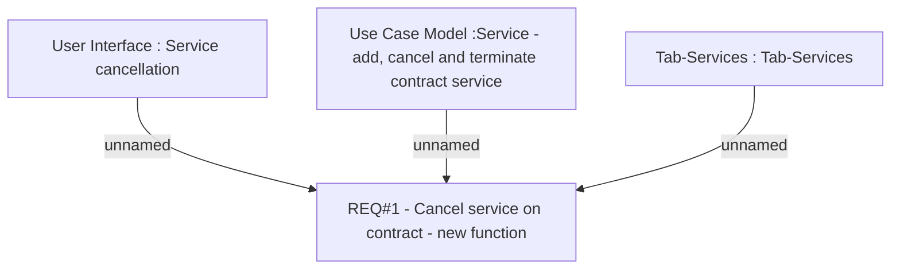

# CBL-6070 (CLM-2053) New service type for offering additional product

- **Diagram Type**: Custom
- **Package**: HomerSelect/BSL/Requirements Model/Finished/CLM/CBL-6070 (CLM-2053) New service type for offering additional product
- **Diagram ID**: 117975
- **Elements**: 4
- **Connectors**: 3

