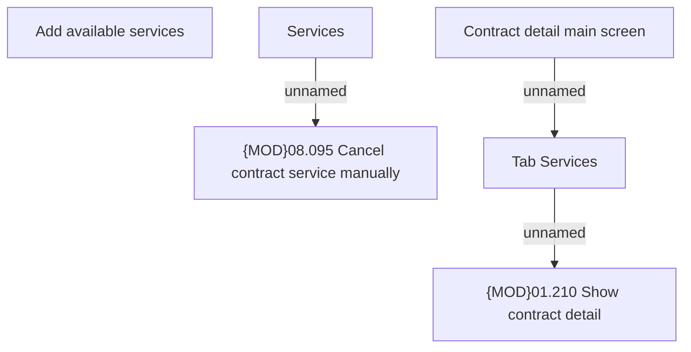

# Contract - Service tab - Cancel service action

- **Diagram Type**: Custom
- **Package**: HomerSelect/BSL/Requirements Model/Finished/CLM/CBL-6070 (CLM-2053) New service type for offering additional product
- **Diagram ID**: 117976
- **Elements**: 6
- **Connectors**: 3

