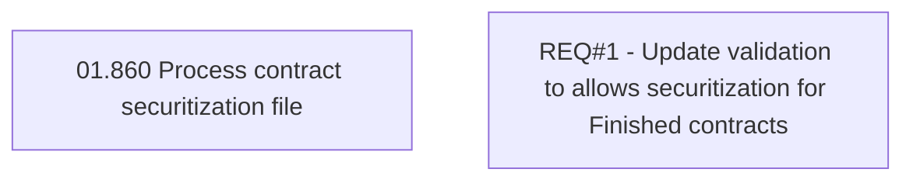

# CBL-6099 (CLM-2270) Extend Contract Securitization for Finished contracts

```mermaid
graph TD
    n_01_860_Process_contract_securitization_file["01.860 Process contract securitization file"]
    REQ_1_Update_validation_to_allows_securitization_for_Finishe["REQ#1 - Update validation to allows securitization for Finished contracts"]
```
