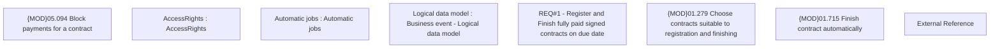

# CBL-6141 (CLM-2022) Register and finish fully paid signed contracts on due date

```mermaid
graph TD
    MOD_05_094_Block_payments_for_a_contract["{MOD}05.094 Block payments for a contract"]
    AccessRights_AccessRights["AccessRights : AccessRights"]
    Automatic_jobs_Automatic_jobs["Automatic jobs : Automatic jobs"]
    Logical_data_model_Business_event_Logical_data_model["Logical data model : Business event - Logical data model"]
    REQ_1_Register_and_Finish_fully_paid_signed_contracts_on_due["REQ#1 - Register and Finish fully paid signed contracts on due date"]
    MOD_01_279_Choose_contracts_suitable_to_registration_and_fin["{MOD}01.279 Choose contracts suitable to registration and finishing"]
    MOD_01_715_Finish_contract_automatically["{MOD}01.715 Finish contract automatically"]
    External_Reference["External Reference"]
```
