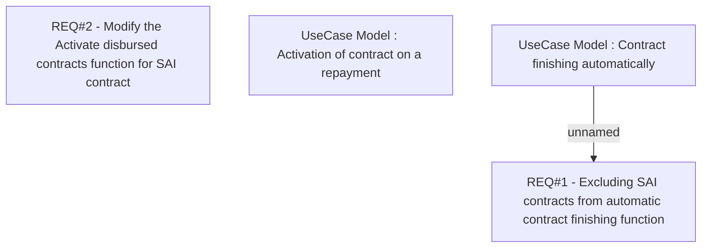

# CBL-6146 (CLM-2017) Change Logic of Payment Reversal for SAI Contract

```mermaid
graph TD
    REQ_2_Modify_the_Activate_disbursed_contracts_function_for_S["REQ#2 - Modify the Activate disbursed contracts function for SAI contract"]
    REQ_1_Excluding_SAI_contracts_from_automatic_contract_finish["REQ#1 - Excluding SAI contracts from automatic contract finishing function"]
    UseCase_Model_Activation_of_contract_on_a_repayment["UseCase Model : Activation of contract on a repayment"]
    UseCase_Model_Contract_finishing_automatically["UseCase Model : Contract finishing automatically"]
    UseCase_Model_Contract_finishing_automatically -->|unnamed| REQ_1_Excluding_SAI_contracts_from_automatic_contract_finish
```
